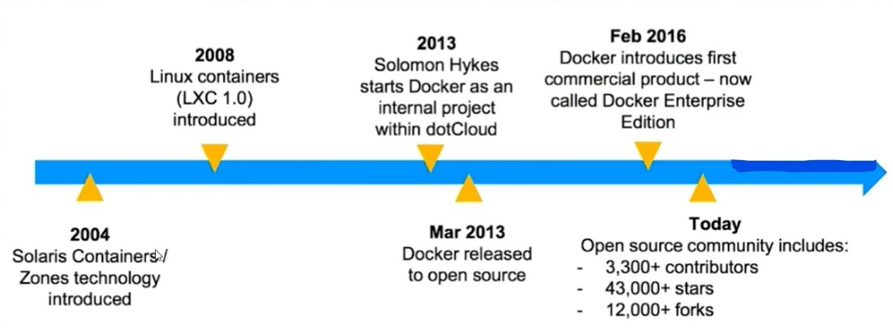
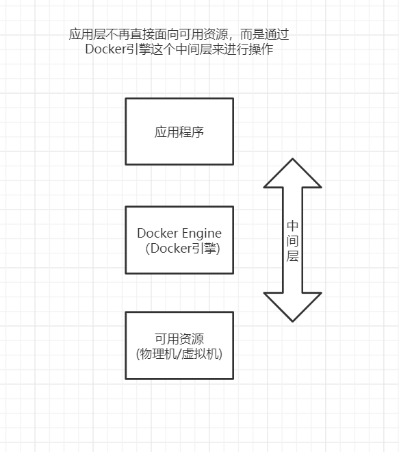
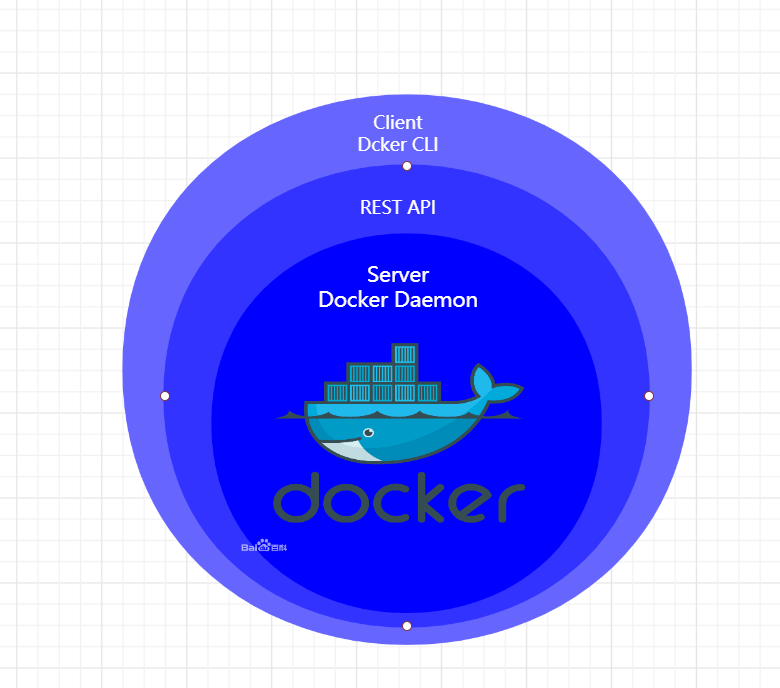
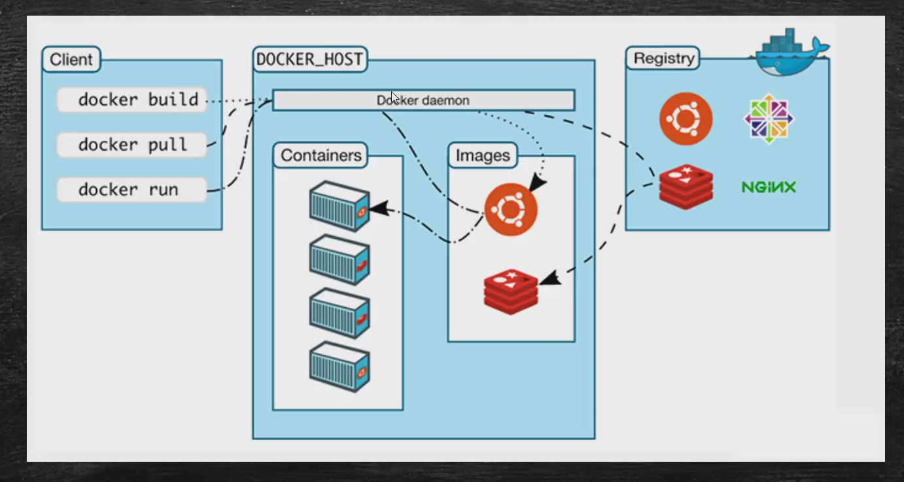

## 前言
#### 是什么
+ 开源的应用容器引擎，基于Go语言开发
+ Docker是提供应用打包，部署与运行应用的容器化平台
+ Docker容器是完全使用沙箱机制的，容器开销极低
+ Docker也具备一定虚拟化职能
+ Docker提供了标准化的应用打包方式

#### 发展历史

#### 版本 - CE && EE
+ Docker CE		#社区开源版
+ Docker EE		#企业版

#### 原理

#### docker体系结构
##### Docker引擎的三个部分
1. Docker Server(Docker Daemon守护进程)
2. REST API(通信层)
3. Client Docker CLI(客户层，客户端)

+ 客户端通过REST API向Docker Server发送请求和指令
+ Docker Server处理后将结果通过REST API返回给客户端
+ Docker是基于[REST API](https://blog.csdn.net/qq_42611547/article/details/84346809)进行通讯的，所以它们应用的协议是HTTP，正是因为居于了WEB应用标准的HTTP的协议，所以Docker的兼容性与扩展性是很好的
+ Docker服务都是通过Docker Daemon(Docker核心进程)来处理的
+ 使用Docker客户端，可以连接到远程服务器对外暴露的REST API来完成对容器和镜像的管理，提高运维效率。

#### 镜像与容器
##### 镜像

+ 是文件，只读，提供了运行程序完整的软硬件资源，是应用程序的集装箱，安装文件。

##### 容器

+ 是镜像的实例，由Docker负责创建，容器与容器之间彼此隔离。

#### Docker执行流程

## 获取&&安装Docker

+ 参考[官方安装文档](https://docs.docker.com/get-docker/)进行安装

#### 配置Docker镜像加速(加速国内访问)
~~~~
vi /etc/docker/daemon.json

{
  "registry-mirrors": [
	"https://hub-mirror.c.163.com/"
  ]
}
~~~

#### Docker Hub(Docker官方镜像中心)

+ [Docker Hub](https://hub.docker.com/)

