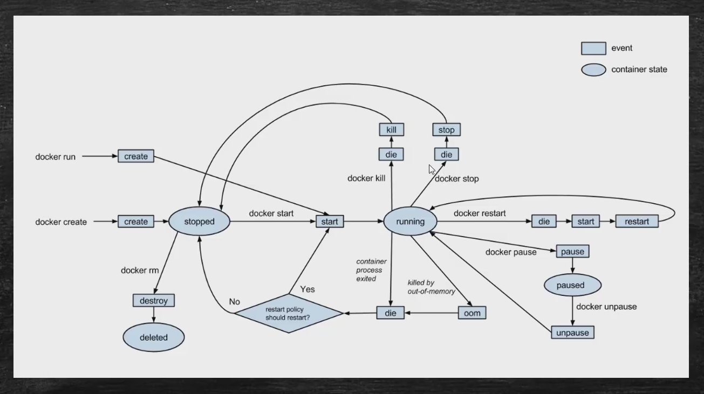

#### 基础操作命令
~~~bash
#从Docker远程仓库抽取镜像,tags是远程镜像的版本标签,默认为latest
docker pull 镜像名:tags

#查看本地镜像
docker images

#查看正在运行中的容器
docker ps

#列出所有运行过的容器
docker ps -a

#创建容器，启动应用
docker run	镜像名:tags

#创建容器,启动应用,-d(容器后台运行),-p(映射容器80端口到宿主机80),
# --name(给容器命名) --link(将容器链接到其他容器，在其他容器中可通过容器名进行容器间互联互通)
docker run 镜像名:tags -d --name nginx --link mysql -p 80:80

#暂停容器
docker pause 容器ID

#恢复容器
docker unpause	容器ID

#删除容器,-f(强制删除,不建议，应先停止容器再删除)
docker rm -f 容器ID

#删除镜像,-f(强制删除)
docker rmi-f 镜像名:tags

#exec在对应容器中执行命令,-it(采用交互方式执行命令)
docker exec -it 容器ID 命令

#查看容器原始信息
docker inspect 容器ID	
~~~

