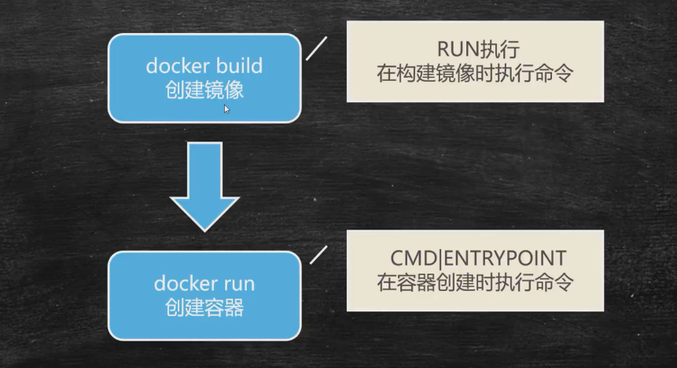
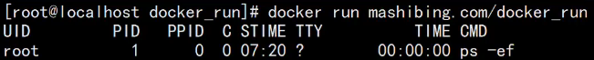

## 不同的命令执行方式
#### shell执行方式
>我们所执行的任何程序，都是由父进程(parent process)所产生出来的一个子进程(child process)，子进程在结束后，将返回到父进程去。
这在Linux系统中被称为 fork。当子进程被产生的时候，将会从父进程那里获得一定的资源分配、及(更重要的是)继承父进程的环境﹗ 

在使用shell执行时，当前shell是父进程，生成一个子shell进程，在子进程中执行脚本，脚本执行完毕后退出子shell，回到当前父进程shell，不会对父进程有任何影响

#### Exec执行方式
使用Exec方式，会用Exec进程替换当前进程，且保持进程PID不变，执行完毕直接退出，不会退回到之前的进程环境

## 不同的执行时机

#### RUN & CMD & ENTRYPOINT
```dockerfile
RUN	#在构建镜像时执行命令
ENTRYPOINT	#容器启动时执行的命令
CMD	#容器启动后执行默认的命令或参数
```



#### RUN - 构建时运行
~~~dockerfile
RUN yum install -y vim	#Shell命令格式
RUN ["yum","install","-y","vim"]	#Exec命令格式
~~~

#### ENTRYPOINT
```dockerfile
#ENTRYPONT用于在容器启动时执行命令
#Dockerfile中只有最后一个ENTRYPOINT会被执行
ENTRYPOINT ["echo"]	#执行系统中echo命令
```

#### CMD
```dockerfile
#CMD用于设置默认执行的命令
#如果Dockerfile中出现多个CMD，则只有最后一个被执行
#如容器启动时有附加指令，则CMD被忽略
#docker run -idt xxx 附加指令
CMD ["echo"]	#执行系统中echo命令
```

#### ENTRYPOINT和CMD联合使用
```dockerfile
#CMD ["-ef"]	= docker run xxx -ef
#同时CMD可以外部传参：docker run xxx -要执行的参数
ENTRYPOINT ["ps"]
CMD ["-ef"]
```


