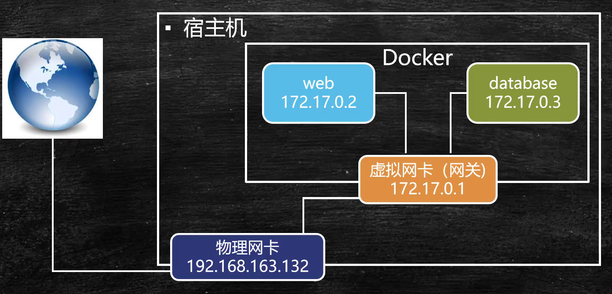
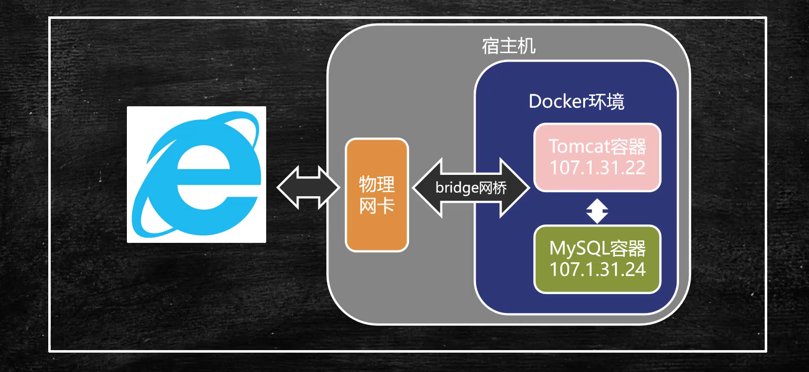

####  容器间的单向访问
+ 容器间不用知道彼此的存在
+ Docker同一网桥下的虚拟ip之间天然互通
+ --link(将容器链接到其他容器，在其他容器中可通过容器名进行容器间互联互通)
+ 容器间互联不建议使用虚拟ip，建议给docker容器命名(--name)，使用容器关联命令(--link)可以使容器使用容器名称进行互通。

#### 基于Bridge网桥双向通信(Docker虚拟网卡)
+ 容器绑定在同一个网桥实现容器间双向互联互通
+ 每个容器都有一个关联的网桥用于承担容器与外界间通讯的桥梁
~~~
#docker网络服务命令，ls列出docker网络底层的明细信息
docker network ls

#新建网桥
docekr network create -d bridge 网桥名称

#容器绑定网桥
docker network connect 网桥名称 要绑定的容器名称
~~~

