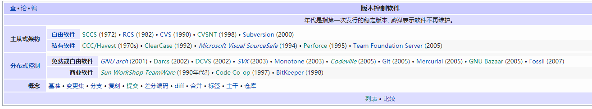
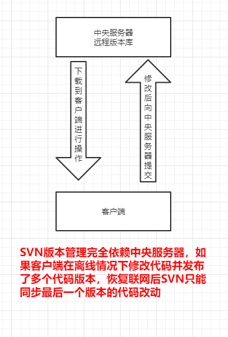
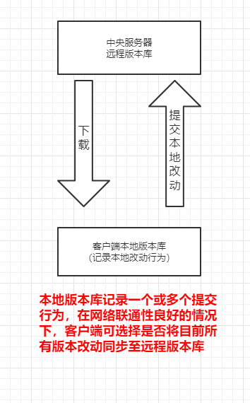

#### 版本管理
+ 在我们写论文时，初稿为第一版，在对初稿进行修改校正后的为第二版，那第二版对比第一版删除，增加，修改了什么，我们怎么知道呢？

  这时如果老师想看你的初稿，但没有及时备份，且第二版是在初稿源文件上直接修改得到的，这时就非常需要有这么个工具来管理你的论文。

+ 这类工具有很多

  

#### Git和SVN的区别
##### SVN
+ SVN是集中式版本控制系统，版本库是集中放在中央服务器的
	+ 工作流程如下：

	  
	
+ 优缺点：
	+ 优点：简单容易操作
  
  + 缺点：
    		1.需要从下载代码
     
     ​	2.离线无法提交代码，无法及时记录我们的提交行为 

##### Git
+ 不仅中央服务器可以保存版本库，本地也可以保存版本库，及时记录了提交行为。

#### Linux，Git 与Linus Torvalds(Linux之父)
+ [Linux，Git 之父Linus Torvalds传奇人生](https://zhuanlan.zhihu.com/p/348154124)
+ [Git 10 周年之际，创始人 Linus Torvalds 访谈](https://www.cnblogs.com/RTdo/p/4401544.html)
+ [Linux 30年专访：Linus Torvalds谈Linux内核开发与Git](https://mp.weixin.qq.com/s/DclB_EoJFxYcRe4lcM9hgw)

#### Git安装
Windows：[官网下载](https://git-scm.com/)

Linux：系统默认安装

~~~bash
#Ubuntu && Debian
sudo apt-get install git

#Centos
sudo yum install git
~~~

