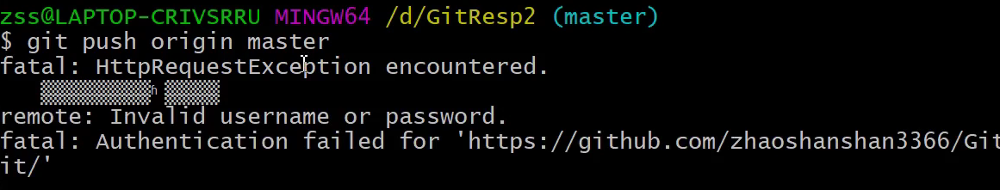

#### 协同开发时远程仓库冲突
1. A开发者向工作区Test3.txt第二行添加新内容，并提交到本地仓库，推送到远程仓库。
2. B开发者也向工作区Test3.txt第二行文件添加新内容，并提交到本地仓库，推送到远程仓库。A,B两者添加的内容不同。
3. 出现冲突，推送失败
原因：操作同一文件的同一位置的时候，就会引起冲突，因为B未先将A提交到远程仓库的内容合并到本地工作区

4. 在冲突的情况下，先拉取远程仓库，然后查看，修改，解决冲突，再推送到远程服务器。

   具体操作参考[4.Git分支.md](./4.Git分支.md)

