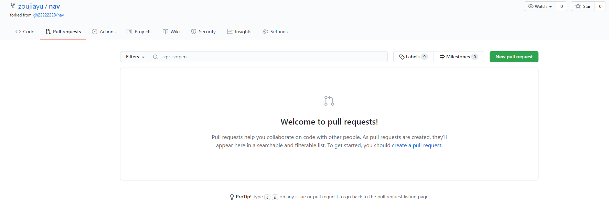

1. 在目标仓库点击fork
2. 回到自己的Github主页，查看被fork到自己主页的仓库
3. 将自己主页的远程仓库克隆到本地，并且进行修改
4. 修改后，添加到暂存区，提交到本地库，并push到远程仓库
5. 进行pull request操作
   
6. 选择New pull request—Create pull request
编写 pull request 描述，选择Create pull request，提交
7. 等待目标仓库所有者同意pull request请求，同意后代码将被合并进目标仓库