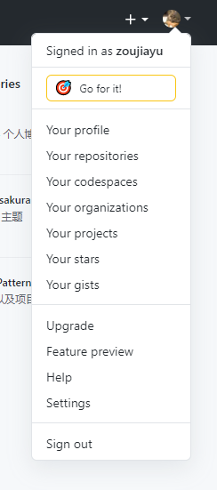

>好处：免密，不用进行身份验证。缺陷：只可设置一个账户免密登录
1. 进入系统当前用户主目录
~~~bash
cd ~
~~~

2. 执行命令，生成.ssh文件夹
~~~bash
ssh-keygen -t rsa -c Github账户对应的邮箱
~~~
按提示按三次Enter

3. 进入当前用户主目录找到.ssh文件夹(需要在文件管理器中勾选查看隐藏的项目)，找到id_rsa.pub以文本格式打开，复制全部文本

4. 点头像位置，Settings—SSH and GPG keys—New SSH key
   起一个key标题，将刚才复制的内容粘贴到key文本框，点击Add SSH key
   
   
5. 复制远程仓库SSH地址

6. 回到Git终端，设置远程仓库SSH地址别名
   ~~~bash
   git remote add 别名 远程仓库SSH地址
   ~~~

7. 进行测试，向远程仓库推送文件