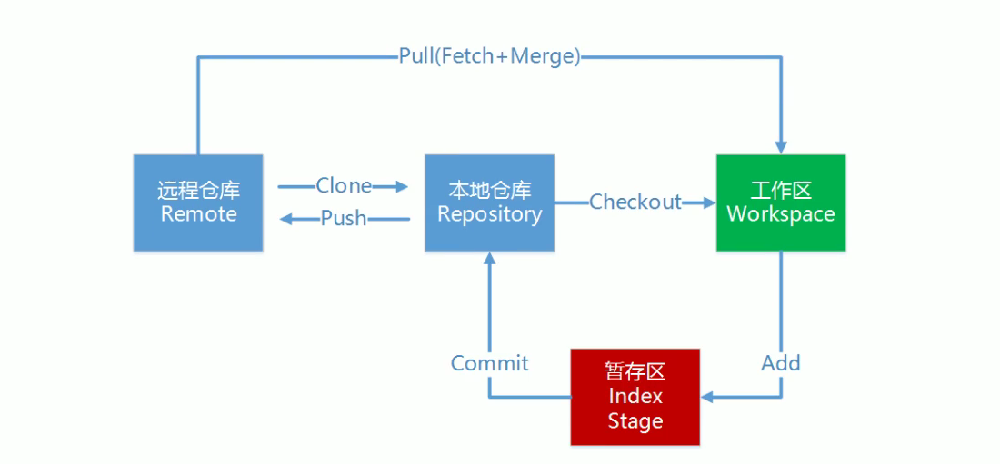

#### 流程图

#### 概念详解
1. 本地仓库：是在开发人员自己电脑上的Git仓库，存放我们的代码(.git隐藏文件夹就是我们的本地仓库)
2. 远程仓库：是在远程服务器上的Git仓库，存放代码(可以是Github，Gitee上的仓库，或是自建的)
3. 工作区：我们自己写代码(文档)的地方
4. 暂存区：在本地仓库中的一个特殊的文件(index)叫缓存区，临时存储我们即将要提交的文件
5. Clone：克隆，将远端仓库复制到本地仓库
6. Push：推送，将本地仓库代码上传到远程仓库
7. Pull：拉取，将远程仓库代码下载到本地仓库，并将代码克隆到本地工作区

