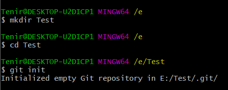
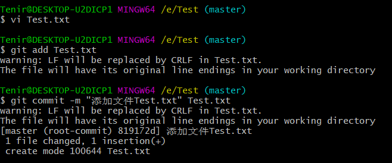
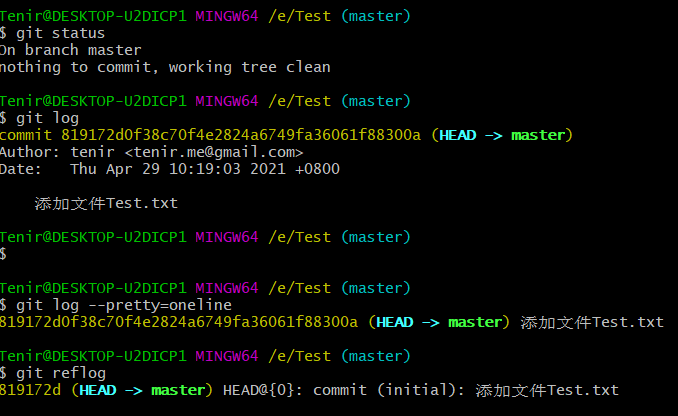
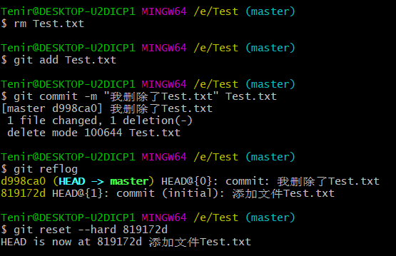
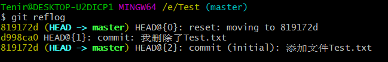
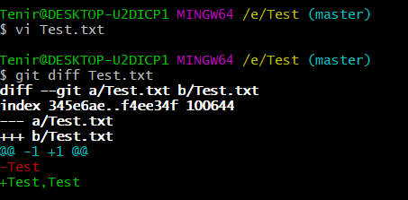
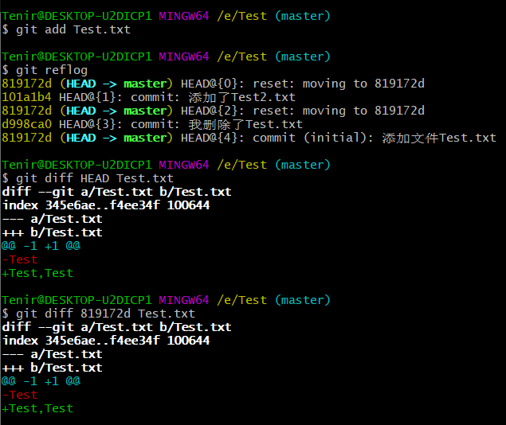

>进入Git命令行

+ Windows：安装完成后回到桌面，空白处右键，选择Git Bash Here
+ Linux：桌面环境下请打开命令行终端，服务器命令行界面直接使用

>查看Git版本
~~~
git --version
~~~

>设置用户名和邮箱
~~~
git config --global user.name "admin"
git config --global user.email "admin@admin.com"
~~~

>配置git代理(将请求转发给你的代理服务器来加速访问远端仓库)
~~~bash
#无代理服务器可跳过c步
vi ~/.gitconfig
[http]
    proxy = http://127.0.0.1:10809
[https]
    proxy = https://127.0.0.1:10809
~~~

>创建本地仓库，仓库初始化
~~~bash
#新建仓库文件夹
mkdir 仓库文件夹名

#进入仓库文件夹
cd 仓库文件夹名

#初始化仓库，并默认初始化master分支
git init
~~~

>add和commit
~~~bash
#需要先进入新建的仓库，再操作
#不放进本地仓库的文件，git是不进行管理的
#即使放进本地仓库的文件，git也不管理，必须通过add，commit命令提交到暂存区进行后续管理。

#创建新文件，将新文件暂存在暂存区(加入版本控制)
git add Test.txt

#将暂存区文件提交到本地仓库中，并生成commit(提交描述)
git commit -m "添加文件Test.txt" Test.txt

#将当前仓库下所有文件加入版本控制中
git add -A
~~~

>status
~~~bash
#查看工作区和暂存区的状态
git status
~~~

>暂存文件恢复过去的状态
~~~
git rm --cached 文件名
~~~

>log
~~~bash
#查看所有的提交日志
#方式一：
git log		#以分页的方式展示
#方式二：
git log --pretty=oneline	#以行的方式展示
#方式三：
git log --oneline
#方式四：
git reflog	#多了HEAD信息，数字指回到当前历史版本需要多少步
#git reflog的日志样式
#索引	HEAD信息	行为日志
~~~

>reset
~~~bash
#前进或回退历史版本

#查看索引
git reflog

#确定想要回退到哪一步，复制对应的索引
git reset --hard 索引

# --hard参数，本地库执行前进或回退操作时，暂存区，工作区也进行相应操作。
# --mixed参数，本地库执行前进或回退操作时，暂存区进行相应操作，工作区不改动。
# --soft参数，本地库执行前进或回退操作时，暂存区，工作区都不改动。
~~~

>删除工作区文件，找回本地文件
~~~bash
#删除工作区文件(暂存区，本地库依然保留)
rm Test.txt

#将删除操作同步到暂存区，本地库
git add Test.txt
git commit -m "我删除了Test.txt" Test.txt

#找回本地库中删除的文件，实际上就是将版本回滚到 添加文件Test.txt 的那个版本
#查看索引，找到 添加文件Test.txt 的索引
git reflog
git reset --hard 索引
~~~

>diff(比对文件差异)
~~~bash
#给本地工作区的Test.txt添加了内容(,Test)，然后将工作区和暂存区的内容进行对比
git diff Test.txt
~~~

~~~bash
#添加更改到暂存区
git add Test.txt
#将暂存区和本地库的内容进行对比
git diff HEAD Test.txt
~~~

~~~bash
#Git是按照行为单位管理数据，所以删除一行，添加一行
@@ -1 +1 @@
-Test	# - 删除
+Test,Test	# + 添加

#多个文件比对(比较工作区，暂存区所有文件的差异)
git diff
~~~

>将本地仓库代码提交到远端仓库
~~~
#添加远端链接
git remote add origin 远端仓库链接

#查看远端链接
git remote -v

#提交到远程仓库,并创建分支master
git push -u origin master

# origin:远端链接名字，master:分支名字
# -u:以后使用直接在仓库内输入git push，不用再输入远端链接名字和分支名字
~~~

>拉取远程文件或远端仓库
~~~
git clone 远端链接 新目录名
~~~

