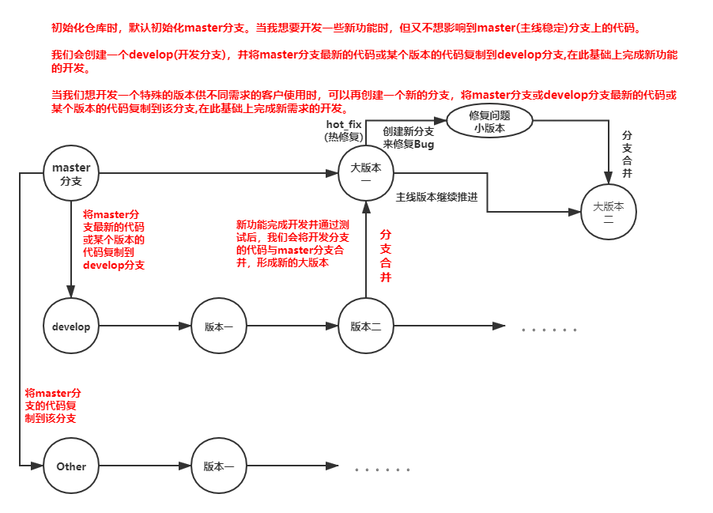
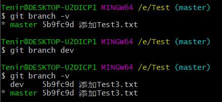
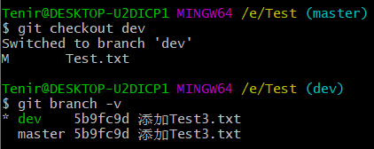
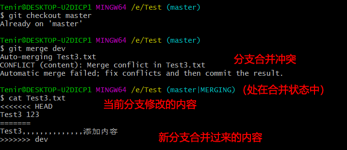
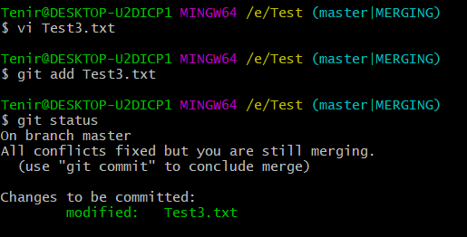
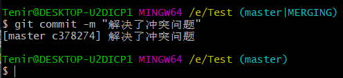

#### 分支原理

##### 优点
+ 同时多个分支可以并行开发，互不耽误，互不影响，提高开发效率
#### Git分支的理解

+ 建议看[Git分支的理解](https://www.cnblogs.com/matengfei123/p/8252128.html)这篇文章，帮助你去更好理解Git分支

#### 操作分支
>查看分支
~~~
git branch -v
~~~

>创建分支
~~~
git branch 新分支名称
~~~

星号表示当前在哪个分支

>切换分支
~~~
git checkout 分支名
~~~

>分支重命名
~~~
#本地分支重命名(还没有推送到远程)
git branch -m oldName newName

#远程分支重命名(本地分支和远程对应分支名称相同)
git branch -m oldName newName
~~~

>删除分支
~~~
git push --delete origin oldName
~~~

>上传新命名的本地分支
~~~
git push origin newName
~~~

>本地分支与远程分支关联\
~~~
git branch --set-upstream-to origin/newName
~~~

>分支冲突，解决冲突

冲突：
1. 在新分支下向Test3.txt添加新内容，再切换回主分支向Test3.txt文件添加新内容，两者添加不同的内容。
2. 切换回主分支，合并主分支和新分支
~~~
git checkout master
git merge 新分支的名称
~~~
3. 合并出现冲突

解决冲突：
1. 人为决定留下想要的内容，修改Test3.txt

2. 将Test3.txt提交到缓存区

   

+ 检查到文件已经改动，冲突已解决，但目前还是处于合并状态中，必须commit才能把合并状态给解决

3. 进行commit操作，解除合并状态

   

+ 在冲突状态下，commit命令不能带文件名，否则出错

