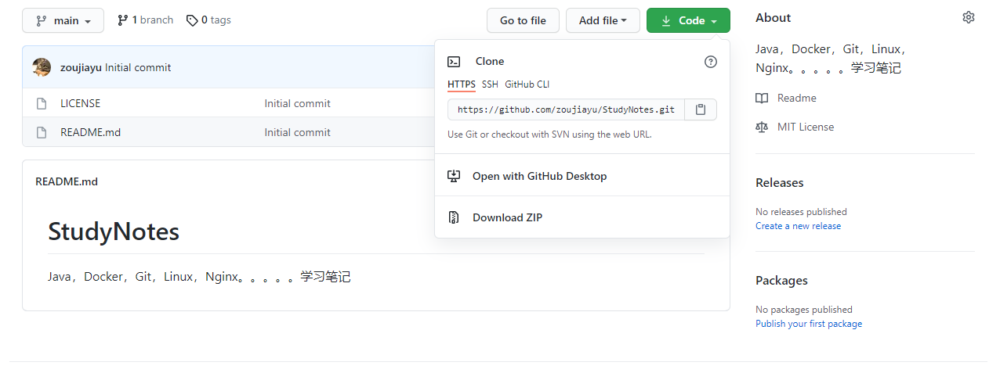
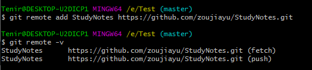

#### 项目远程仓库地址
1. 进入新建的仓库，点击Code
2. 

3. 选择HTTPS，点链接框旁边的复制按钮，复制远程仓库地址

#### 本地创建远程仓库地址别名
+ 由于远程仓库地址较长，每次复制比较麻烦，为方便以后数据提交方便，系统提供了一种地址保存方式，在Git本地将地址保存，通过别名。

1. 进入Git终端，为远程仓库创建对应的本地仓库并初始化
2. git remote -v	(查看是否已设置远程仓库别名)
3. git remote add 别名 项目远程仓库地址	（添加仓库别名）

+ fetch：可以从对应的地址取回数据，push：可以从对应的地址推送数据
+ 别名可以按需求自己取