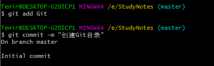
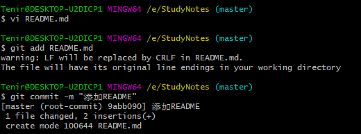
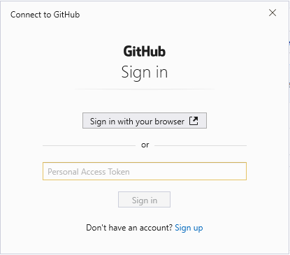
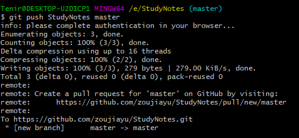

#### 推送
1. 前面我们已经将远程仓库创建，本地仓库初始化并给远程仓库地址设置别名

2. 在本地仓库添加数据并将数据推送到远程仓库
    这里我创建一个新目录Git，并添加README.md文件

  

  
3. 执行推送操作
~~~bash
#git push 远程仓库地址别名 要推送到远程仓库哪个分支
 git push StudyNotes master
~~~
4. 执行后会弹出Github登录窗口，选择Sign in with your browser
    登录你的Github账户，并授权Git访问你的Github账户

5. 推送完成，进入Github远程仓库查看并确认提交

+ 可能报错
~~~bash
error: src refspec master does not match any
error: failed to push some refs to 'https://github.com/xxx/xxxxx.git'
~~~
+ 原因
1. 本地git仓库目录下为空
2. 本地仓库add后未commit
3. git init错误

#### 克隆
~~~ bash
git clone 远程仓库地址
~~~
>克隆操作可以帮助我们完成
1. 初始化本地库
2. 将远程仓库内容完整克隆到本地
3. 替我们创建远程仓库别名