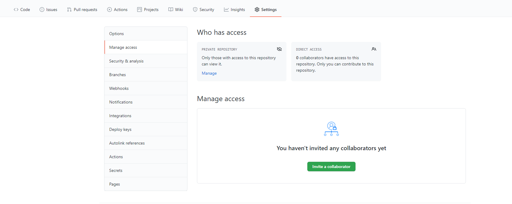

#### 清除Git中Github账户缓存
1. Win+s，搜索 凭据管理器，选择Windows凭据，(仅Win10)
2. 删除git:https://github.com的凭据

防止在多人共享的机器上，因Github账号被Git缓存导致使用该机器的其他开发人员可以在不经确认的情况下向远程仓库推送数据。

#### 邀请加入团队
1. 进入Github仓库，选择 Settings—Manage access
2. 选择Invite a collaborator，输入被邀请人的名称或邮箱
3. 复制邀请链接，使用其他工具发送邀请链接给被邀请人
4. 被邀请人接受邀请，成功加入团队。
